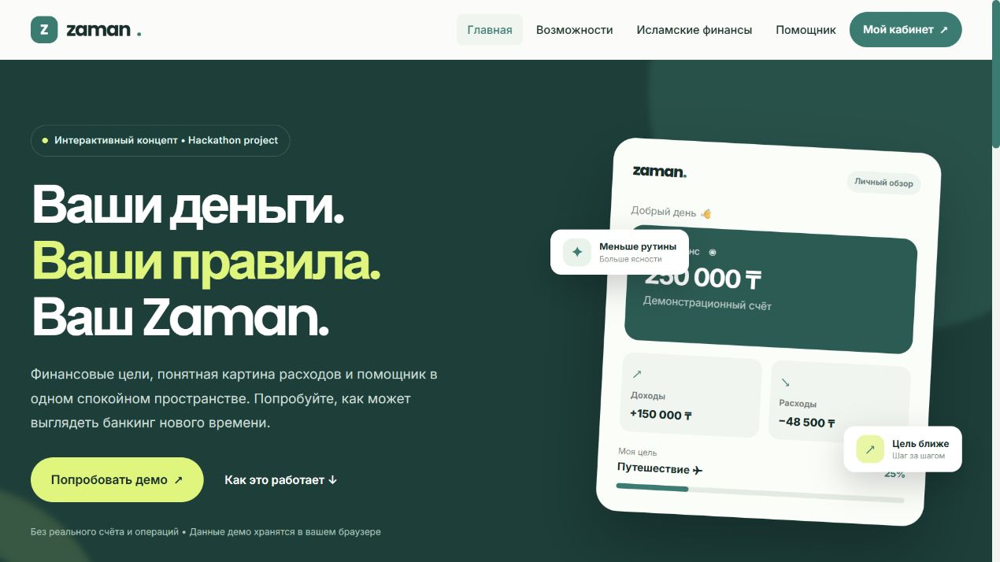

# Zaman

Интерактивный концепт финансового сервиса, созданный для хакатона. В демо можно посмотреть финансовый кабинет, создать цель накопления и поговорить с помощником. Сайт работает без внешних библиотек и банковского сервера.



## Запуск

Нужен Node.js. Из папки проекта:

```bash
npm run dev
```

Откройте [http://127.0.0.1:4173](http://127.0.0.1:4173). Для проверки ссылок и синтаксиса:

```bash
npm run check
```

Можно разместить файлы как статический сайт. Для разработки открывайте сайт через локальный HTTP сервер, поскольку браузерные ES модули могут не работать при открытии HTML через `file://`.

## Что можно попробовать

1. На главной нажмите **Попробовать демо**.
2. Введите вымышленные email и пароль длиной от 6 символов. Это имитация входа, пароль никуда не отправляется и не сохраняется.
3. В кабинете создайте финансовую цель. Она останется в `localStorage` этого браузера после перезагрузки.
4. Откройте помощника и выберите готовый вопрос.

## Границы демо

Zaman не является банком. Баланс, операции, журнал администратора и ответы помощника демонстрационные. Реального AI, переводов, банковской авторизации и серверной защиты нет. Не вводите настоящие пароли, реквизиты или другие чувствительные данные. Контактная форма удалена, поскольку у проекта нет сервера для отправки сообщений.

## Структура

- `index.html`, `project.css` — главная и общий визуальный стиль.
- `dashboard.html`, `dashboard.js` — кабинет и цели.
- `ai_assistant.html`, `ai_chat.js` — демонстрационный чат.
- `api.js` — API слой; по умолчанию включён локальный mock режим.
- `auth.js`, `ui.js`, `validator.js` — состояние демо входа, интерфейс и проверка форм.
- `server.cjs`, `checks.cjs` — локальный сервер и базовая проверка проекта.

Для превращения концепта в реальный финансовый сервис потребуются бэкенд, безопасная авторизация, хранение данных на сервере, подтверждение операций и юридическая проверка банковских и исламских финансовых продуктов.
